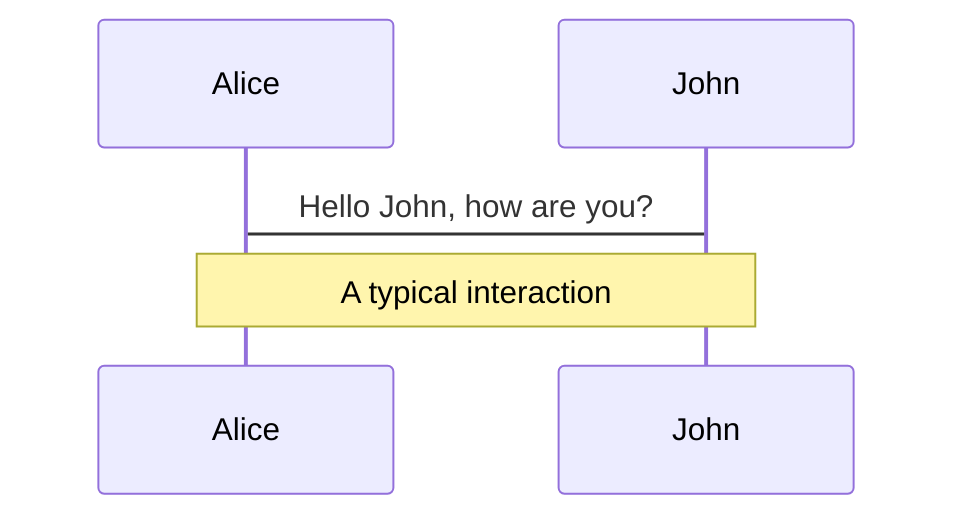
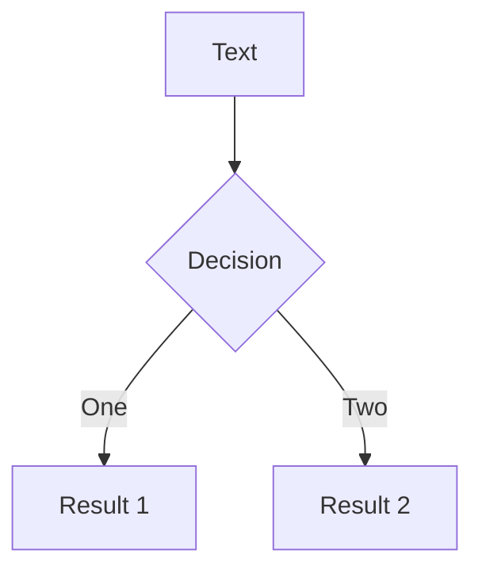
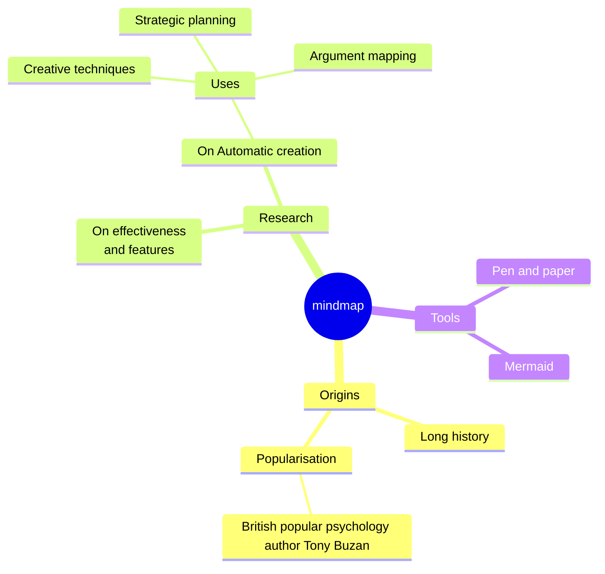
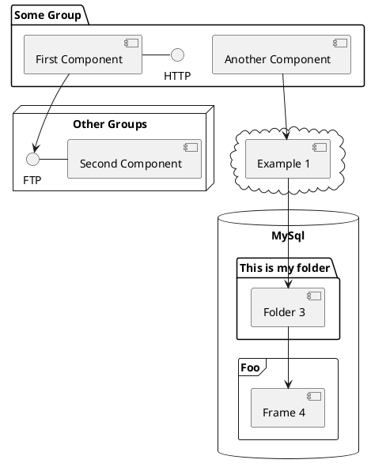

---
# You can also start simply with 'default'
theme: seriph
# random image from a curated Unsplash collection by Anthony
# like them? see https://unsplash.com/collections/94734566/slidev
background: ./cider-4484017.jpg
# some information about your slides (markdown enabled)
title: Iterators & Generators in EcmaScript
info: |
  ## Iterators & Generators in EcmaScript

  Made with [Sli.dev](https://sli.dev)
# apply unocss classes to the current slide
class: text-center
# https://sli.dev/features/drawing
drawings:
  persist: false
# slide transition: https://sli.dev/guide/animations.html#slide-transitions
transition: slide-left
# enable MDC Syntax: https://sli.dev/features/mdc
mdc: true
---

# Iterators & Generators in EcmaScript

Let's learn more about them

<div @click="$slidev.nav.next" class="mt-12 py-1" hover:bg="white op-10">
  Press Space for next page <carbon:arrow-right />
</div>

<div class="abs-br m-6 text-xl">
  <button @click="$slidev.nav.openInEditor()" title="Open in Editor" class="slidev-icon-btn">
    <carbon:edit />
  </button>
  <a href="https://github.com/slidevjs/slidev" target="_blank" class="slidev-icon-btn">
    <carbon:logo-github />
  </a>
</div>

<!--
The last comment block of each slide will be treated as slide notes. It will be visible and editable in Presenter Mode along with the slide. [Read more in the docs](https://sli.dev/guide/syntax.html#notes)
-->

---

<Toc text-sm minDepth="1" maxDepth="2" />

---

# What is an iterator

An iterator is any object that conforms to the <code>Iterator</code> protocol
<v-switch>
<template #1>
```typescript {*} twoslash
const iterator: Iterator<number> = {
};
```
</template>
<template #2>
Let's fix it!
```typescript {monaco-run}{height: '150px'}
const iterator: Iterator<number> = {
};
```
</template>
</v-switch>


---

# Okay but what can I do with an Iterator?

You can call `next()` on it to obtain values:
```typescript {monaco-run} {showOutputAt:'+1'}
const naturals = {
  current: 0,
  next() {
    return { done: false, value: this.current++ };
  }
}

console.log(naturals.next());
console.log(naturals.next());
console.log(naturals.next());
```

---

# Using an <code>Iterator</code> in a for-of loop...
<v-switch>
<template #1>
...is not possible...
```typescript {8} twoslash
const naturals = {
  current: 0,
  next() {
    return { done: false, value: this.current++ };
  },
}

for (const n of naturals) {
  if (n >= 5) {
    break;
  }
  console.log(n)
}
```
</template>
<template #2>
...because an <code>Iterable</code> is required, let's fix it:
```typescript {monaco-run}
const naturals = {
  current: 0,
  next() {
    return { done: false, value: this.current++ };
  },
}

for (const n of naturals) {
  if (n >= 5) {
    break;
  }
  console.log(n)
}
```
</template>
</v-switch>

---
transition: slide-up
---

# There's an easier way to define iterable iterators: generator functions!
````md magic-move
```typescript
const naturals = {
  current: 0,
  next() {
    return { done: false, value: current++ };
  },
  [Symbol.iterator]() {
    return this;
  }
}
```
```typescript
function* naturals() {
  let current = 0;
  while (true) {
    yield current++;
  }
}
```
````

---

# More <code>Iterable</code> tricks

You can destructure an <code>Iterable</code>:
```ts {monaco-run} {showOutputAt:'+1'}
function* naturals() {
  let current = 0;
  while (true) {
    yield current++;
  }
}

const [a, b, c] = naturals();
console.log(a, b, c);
```

---

# More <code>Iterable</code> tricks

You can spread an <code>Iterable</code>:
```ts {monaco-run} {showOutputAt:'0'}
function* upTo5() {
  let current = 0;
  while (current <= 5) {
    yield current++;
  }
}

console.log(...upTo5());
```
<v-click at="+2">Beware that spreading an infinite iterator will never complete!</v-click>

---

# Generators don't just offer next()

<v-switch>
<template #1>
<code>return</code> for cleanup and dispose. Once called, the iterator will always be done.
```typescript {monaco-run} {autorun:false}
function* naturals() {
  let current = 0;
  while (true) {
    yield current++;
  }
  return 42;
}

const it = naturals();
console.log(it.return(3));
console.log(it.next());
```
</template>

<template #2>
<code>throw</code> to make it error
```typescript {monaco-run} {autorun:false}
function* naturals() {
  let current = 0;
  while (true) {
    yield current++;
  }
}

console.log(naturals().throw(new Error('boom')));
```
</template>

<template #3>
Any <code>Iterator</code> can implement these optional methods too:
```typescript {monaco-run} {autorun:false}
const answer: Iterator<number> = {
  next() {
    return { done: false, value: 42 };
  },
  return(value: number) {
    return { done: true, value };
  },
  throw(error: unknown) {
    throw error;
  }
}

console.log(answer.next());
console.log(answer.return?.(3));
console.log(answer.throw?.(new Error('kaboom')));
```
</template>
</v-switch>

---

# Iterator helpers

New methods exposed on all sync iterators.

<v-click>
Available as baseline newly available.


</v-click>
<v-clicks>

* 20/02/2024 [Chromium 122](https://developer.chrome.com/blog/chrome-122-beta?hl=en#iterator_helpers)
* 28/03/2024 [Deno 1.42](https://deno.com/blog/v1.42#v8-123-and-typescript-543)
* 24/04/2024 [Node.js 22](https://nodejs.org/en/blog/announcements/v22-release-announce#v8-update-to-124)
* 01/10/2024 [Firefox 131](https://developer.mozilla.org/en-US/docs/Mozilla/Firefox/Releases/131#javascript)
* 18/10/2024 [Bun 1.1.31](https://bun.com/blog/bun-v1.1.31#iterator-helpers)
* 31/03/2025 [Safari 18.4](https://webkit.org/blog/16574/webkit-features-in-safari-18-4/#javascript)

</v-clicks>

---
layout: two-cols-header
layoutClass: gap-16
---

# Iterator helpers

```typescript {none|1}
Iterator.from(object)
```
<v-click>Returns an iterator by calling [Symbol.iterator]() on the object.</v-click>

::left::
## Lazy methods
```typescript {none|1|1-2|1-3|1-4|all}
map(mapper: (value: T) => U)
filter(predicate: (value: T) => boolean)
take(limit: number)
drop(limit: number)
flatMap(mapper: (value: T) => Iterator<U>)
```
<v-click>These methods will only execute their function argument when a value is pulled from the iterator. They all return an iterator when called.</v-click>

::right::
## Final methods
```typescript {none|1|1-2|1-3|1-4|1-5|all}
reduce<T, U>(reducer: (acc: U, value: T) => U, init?: U): U
toArray(): T[]
forEach(consumer: (value: T) => void): void
some(predicate: (value: T) => boolean): boolean
every(predicate: (value: T) => boolean): boolean
find(predicate: (value: T) => boolean): T | undefined
```
<v-click>These methods will consume the iterator and return a value that is usually not an iterator.</v-click>

---
layout: two-cols-header
layoutClass: gap-16
---

# Comparing iterating on an <code>Array</code>

::left::

With <code>Array</code> methods
```typescript {monaco-run}
const array = [1,2,3,4,5,6,7,8,9,10];
const res = array.map(x => 2*x)
        .filter(x => x % 3 !== 0)
        .map(x => 5*x)
        .flatMap(x => [x - 1, x]);
console.log(...res)
```
<v-click>Every method call will iterate on the array and return a new array.</v-click>

::right::

With Iterator helpers
```js {monaco-run}
const array = [1,2,3,4,5,6,7,8,9,10];
const res = array.values()
     .map(x => 2*x)
     .filter(x => x % 3 !== 0)
     .map(x => 5*x)
     .flatMap(function* gen(x) { yield x - 1; yield x; });
console.log(...res);
```
<v-click>Only one loop, it only happens on the last line and no memory allocation!</v-click>

---

# Iterator helpers are nice but we can do more

```typescript {monaco-run}
function* naturals() { let current = 0; while (true) { yield current++ } }

function* zipMap<T1, T2, U>(mapper: (a: T1, b: T2) => U, it1: Iterator<T1>, it2: Iterator<T2>) {
  while (true) {
    const cur1 = it1.next();
    const cur2 = it2.next();
    if (cur1.done || cur2.done) { return; }
    yield mapper(cur1.value, cur2.value);
  }
}

console.log(...zipMap((a, b) => `${a} is before ${b}`, naturals().take(5), naturals().drop(1)));
```

---

# Let's write a chunking function

<v-switch>
<template #1>
```typescript {monaco-run} {autorun:false}
function* naturals() { let current = 0; while (true) { yield current++ } }

function* chunks<T>(iterable: Iterable<T>, size: number) {
  const iterator = Iterator.from(iterable);
  
  while (true) {
    yield iterator.take(size);
  }
}

console.log(...chunks(naturals(), 3).map(it => it.toArray()).take(5));
```
</template>
<template #2>
```typescript {monaco-run} {autorun:false}
function* naturals() { let current = 0; while (true) { yield current++ } }

function* chunks<T>(iterable: Iterable<T>, size: number) {
  const iterator = Iterator.from(iterable);
  
  while (true) {
    yield chunked(iterator, size);
  }
}

function* chunked<T>(iterator: Iterator<T>, size: number) {
  for (let i = 0; i < size; i++) {
    const { done, value } = iterator.next();
    if (done) { return }
    yield value;
  }
}

console.log(...chunks(naturals().take(15), 3).map(it => it.toArray()).take(10));
```
</template>
<template #3>
```typescript {monaco-run} {autorun:false}
function* naturals() { let current = 0; while (true) { yield current++ } }

function* chunks<T>(iterable: Iterable<T>, size: number) {
  const iterator = Iterator.from(iterable);
  
  while (true) {
    const { value, done } = iterator.next();
    if (done) { return; }
    yield chunked(iterator, value, size - 1)
  }
}

function* chunked<T>(iterator: Iterator<T>, value: T, size: number) {
  yield value;
  for (let i = 0; i < size; i++) {
    const { done, value } = iterator.next();
    if (done) { return }
    yield value;
  }
}

console.log(...chunks(naturals().take(15), 3).map(it => it.toArray()).take(10));
```
</template>
</v-switch>

---

# Turns out <code>Iterator</code>s are trickier than they look

<v-clicks>

- No way to differentiate between finish and empty
- No way to know if the iterator is finished without consuming a value
- <code>take</code> & <code>drop</code> will close the underlying iterator
- No built-in cloning feature to alleviate closing
- Edge cases are numerous...
- ...and infinite loops too!

</v-clicks>

---

# My recommendations

<v-clicks>

- Heavily test your code that plays with iterators
- Be aware of the numerous quirks


</v-clicks>

---
layout: image-right
image: https://cover.sli.dev
---

# Code

Use code snippets and get the highlighting directly, and even types hover!

```ts [filename-example.ts] {all|4|6|6-7|9|all} twoslash
// TwoSlash enables TypeScript hover information
// and errors in markdown code blocks
// More at https://shiki.style/packages/twoslash
import { computed, ref } from 'vue'

const count = ref(0)
const doubled = computed(() => count.value * 2)

doubled.value = 2
```

<arrow v-click="[4, 5]" x1="350" y1="310" x2="195" y2="342" color="#953" width="2" arrowSize="1" />

<!-- This allow you to embed external code blocks -->
<<< @/snippets/external.ts#snippet

<!-- Footer -->

[Learn more](https://sli.dev/features/line-highlighting)

<!-- Inline style -->
<style>
.footnotes-sep {
  @apply mt-5 opacity-10;
}
.footnotes {
  @apply text-sm opacity-75;
}
.footnote-backref {
  display: none;
}
</style>

<!--
Notes can also sync with clicks

[click] This will be highlighted after the first click

[click] Highlighted with `count = ref(0)`

[click:3] Last click (skip two clicks)
-->

---
level: 2
---

# Shiki Magic Move

Powered by [shiki-magic-move](https://shiki-magic-move.netlify.app/), Slidev supports animations across multiple code snippets.

Add multiple code blocks and wrap them with <code>````md magic-move</code> (four backticks) to enable the magic move. For example:

````md magic-move {lines: true}
```ts {*|2|*}
// step 1
const author = reactive({
  name: 'John Doe',
  books: [
    'Vue 2 - Advanced Guide',
    'Vue 3 - Basic Guide',
    'Vue 4 - The Mystery'
  ]
})
```

```ts {*|1-2|3-4|3-4,8}
// step 2
export default {
  data() {
    return {
      author: {
        name: 'John Doe',
        books: [
          'Vue 2 - Advanced Guide',
          'Vue 3 - Basic Guide',
          'Vue 4 - The Mystery'
        ]
      }
    }
  }
}
```

```ts
// step 3
export default {
  data: () => ({
    author: {
      name: 'John Doe',
      books: [
        'Vue 2 - Advanced Guide',
        'Vue 3 - Basic Guide',
        'Vue 4 - The Mystery'
      ]
    }
  })
}
```

Non-code blocks are ignored.

```vue
<!-- step 4 -->
<script setup>
const author = {
  name: 'John Doe',
  books: [
    'Vue 2 - Advanced Guide',
    'Vue 3 - Basic Guide',
    'Vue 4 - The Mystery'
  ]
}
</script>
```
````

---

# Components

<div grid="~ cols-2 gap-4">
<div>

You can use Vue components directly inside your slides.

We have provided a few built-in components like `<Tweet/>` and `<Youtube/>` that you can use directly. And adding your custom components is also super easy.

```html
<Counter :count="10" />
```

<!-- ./components/Counter.vue -->
<Counter :count="10" m="t-4" />

Check out [the guides](https://sli.dev/builtin/components.html) for more.

</div>
<div>

```html
<Tweet id="1390115482657726468" />
```

<Tweet id="1390115482657726468" scale="0.65" />

</div>
</div>

<!--
Presenter note with **bold**, *italic*, and ~~striked~~ text.

Also, HTML elements are valid:
<div class="flex w-full">
  <span style="flex-grow: 1;">Left content</span>
  <span>Right content</span>
</div>
-->

---
class: px-20
---

# Themes

Slidev comes with powerful theming support. Themes can provide styles, layouts, components, or even configurations for tools. Switching between themes by just **one edit** in your frontmatter:

<div grid="~ cols-2 gap-2" m="t-2">

```yaml
---
theme: default
---
```

```yaml
---
theme: seriph
---
```


</div>

Read more about [How to use a theme](https://sli.dev/guide/theme-addon#use-theme) and
check out the [Awesome Themes Gallery](https://sli.dev/resources/theme-gallery).

---

# Clicks Animations

You can add `v-click` to elements to add a click animation.

<div v-click>

This shows up when you click the slide:

```html
<div v-click>This shows up when you click the slide.</div>
```

</div>

<br>

<v-click>

The <span v-mark.red="3"><code>v-mark</code> directive</span>
also allows you to add
<span v-mark.circle.orange="4">inline marks</span>
, powered by [Rough Notation](https://roughnotation.com/):

```html
<span v-mark.underline.orange>inline markers</span>
```

</v-click>

<div mt-20 v-click>

[Learn more](https://sli.dev/guide/animations#click-animation)

</div>

---

# Motions

Motion animations are powered by [@vueuse/motion](https://motion.vueuse.org/), triggered by `v-motion` directive.

```html
<div
  v-motion
  :initial="{ x: -80 }"
  :enter="{ x: 0 }"
  :click-3="{ x: 80 }"
  :leave="{ x: 1000 }"
>
  Slidev
</div>
```

<div class="w-60 relative">
  <div class="relative w-40 h-40">
    
    
    
  </div>

  <div
    class="text-5xl absolute top-14 left-40 text-[#2B90B6] -z-1"
    v-motion
    :initial="{ x: -80, opacity: 0}"
    :enter="{ x: 0, opacity: 1, transition: { delay: 2000, duration: 1000 } }">
    Slidev
  </div>
</div>

<!-- vue script setup scripts can be directly used in markdown, and will only affects current page -->
<script setup lang="ts">
const final = {
  x: 0,
  y: 0,
  rotate: 0,
  scale: 1,
  transition: {
    type: 'spring',
    damping: 10,
    stiffness: 20,
    mass: 2
  }
}
</script>

<div
  v-motion
  :initial="{ x:35, y: 30, opacity: 0}"
  :enter="{ y: 0, opacity: 1, transition: { delay: 3500 } }">

[Learn more](https://sli.dev/guide/animations.html#motion)

</div>

---

# LaTeX

LaTeX is supported out-of-box. Powered by [KaTeX](https://katex.org/).

<div h-3 />

Inline $\sqrt{3x-1}+(1+x)^2$

Block
$$ {1|3|all}
\begin{aligned}
\nabla \cdot \vec{E} &= \frac{\rho}{\varepsilon_0} \\
\nabla \cdot \vec{B} &= 0 \\
\nabla \times \vec{E} &= -\frac{\partial\vec{B}}{\partial t} \\
\nabla \times \vec{B} &= \mu_0\vec{J} + \mu_0\varepsilon_0\frac{\partial\vec{E}}{\partial t}
\end{aligned}
$$

[Learn more](https://sli.dev/features/latex)

---

# Diagrams

You can create diagrams / graphs from textual descriptions, directly in your Markdown.

<div class="grid grid-cols-4 gap-5 pt-4 -mb-6">









</div>

Learn more: [Mermaid Diagrams](https://sli.dev/features/mermaid) and [PlantUML Diagrams](https://sli.dev/features/plantuml)

---
foo: bar
dragPos:
  square: 0,-30,0,0
---

# Draggable Elements

Double-click on the draggable elements to edit their positions.

<br>

###### Directive Usage

```md

```

<br>

###### Component Usage

```md
<v-drag text-3xl>
  <div class="i-carbon:arrow-up" />
  Use the `v-drag` component to have a draggable container!
</v-drag>
```

<v-drag pos="2,186,977,_">
  <div text-center text-3xl border border-main rounded>
    Double-click me!
  </div>
</v-drag>


###### Draggable Arrow

```md
<v-drag-arrow two-way />
```

<v-drag-arrow pos="979,-5,-981,552" two-way op70 />

---
src: ./pages/imported-slides.md
hide: false
---

---

# Monaco Editor

Slidev provides built-in Monaco Editor support.

Add `{monaco}` to the code block to turn it into an editor:

```ts {monaco}
import { ref } from 'vue'
import { emptyArray } from './external'

const arr = ref(emptyArray(10))
```

Use `{monaco-run}` to create an editor that can execute the code directly in the slide:

```ts {monaco-run}
import { version } from 'vue'
import { emptyArray, sayHello } from './external'

sayHello()
console.log(`vue ${version}`)
console.log(emptyArray<number>(10).reduce(fib => [...fib, fib.at(-1)! + fib.at(-2)!], [1, 1]))
```

---
layout: center
class: text-center
---

# Learn More

[Documentation](https://sli.dev) · [GitHub](https://github.com/slidevjs/slidev) · [Showcases](https://sli.dev/resources/showcases)

<PoweredBySlidev mt-10 />
